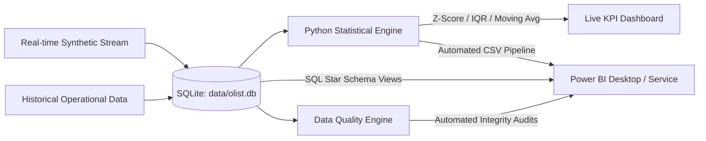

# Automated KPI Monitoring & Alert System — Power BI Deployment Guide

This guide walks through connecting **Power BI Desktop** to the automated Python & SQL operational monitoring pipeline.

---

## 1. Architecture Overview

---

## 2. Ingesting Data into Power BI

You can connect Power BI using **Method A (Instant CSV Folder)** or **Method B (Direct SQLite ODBC)**:

### Method A: Automated CSV Data Export (Recommended & Instant)
1. Open the KPI Dashboard and click **"Export Power BI Dataset"** (or run `python -c "from src.powerbi_exporter import powerbi_exporter; powerbi_exporter.export_all_datasets()"`).
2. The pipeline exports clean datasets into `data/powerbi/`:
   - `powerbi_operational_orders.csv`: Fact table containing orders, revenue, customer location, delivery days, and CSAT scores.
   - `powerbi_daily_kpis.csv`: Daily summarized KPI aggregates for time-series trend analysis.
   - `powerbi_data_quality_audit.csv`: Data quality checks, failure counts, and system integrity scores.
   - `powerbi_regional_summary.csv`: Aggregated state & city volume and revenue.
3. In Power BI Desktop:
   - Click **Get Data** -> **Text/CSV** -> Select `powerbi_operational_orders.csv`.
   - Repeat for `powerbi_daily_kpis.csv` and `powerbi_data_quality_audit.csv`.

### Method B: Live SQLite ODBC Connection
1. Ensure the SQLite ODBC driver is installed on Windows.
2. In Power BI Desktop:
   - Select **Get Data** -> **ODBC** -> select `SQLite3 Datasource`.
   - Point the connection string to `c:\Users\Swetha\Desktop\python learning\kpi indicator\data\olist.db`.
   - Select the pre-built optimized views:
     - `vw_powerbi_operational_orders`
     - `vw_powerbi_daily_kpis`

---

## 3. Power BI Data Model (Star Schema)

- **Fact Table**: `vw_powerbi_operational_orders` (Key: `order_id`)
- **Dimension 1**: `Calendar / Date Dimension` (Key: `order_date`)
- **Dimension 2**: `Regional Geography` (Key: `customer_state`)
- **Audit Table**: `kpi_data_quality_audit` (Key: `audit_id`)

---

## 4. Pre-built DAX Measures

All DAX formulas are included in [DAX_MEASURES.dax](file:///c:/Users/Swetha/Desktop/python%20learning/kpi%20indicator/powerbi/DAX_MEASURES.dax):
- **Financials**: `Total Revenue`, `Average Order Value (AOV)`, `Revenue DoD Growth %`
- **Logistics**: `On-Time Delivery Rate %`, `Average Delivery Time (Days)`, `SLA Breach Count`
- **Customer Experience**: `Average CSAT Score`, `Net CSAT Index %`
- **Statistical Control Limits**: `Revenue Rolling 14D Mean`, `Upper Control Limit (UCL = Mean + 2σ)`, `Lower Control Limit (LCL = Mean - 2σ)`
- **Data Integrity**: `Data Quality Integrity Score %`

---

## 5. Recommended Power BI Dashboard Layout

1. **Executive KPI Ribbon (Top)**:
   - Multi-row Card with **Total Revenue**, **Order Volume**, **AOV**, **On-Time Delivery %**, and **Data Integrity Score**.
2. **Operational Trends & Statistical Control (Middle Left)**:
   - Line & Clustered Column Chart: Daily Revenue (Columns) with Control Bands `UCL` & `LCL` (Dashed Lines) to flag statistical anomalies.
3. **Logistics & Delivery SLA Performance (Middle Right)**:
   - Gauge visual: On-Time Delivery Rate vs Target (92%).
   - Bar chart: Average delivery days by destination state (`customer_state`).
4. **Data Quality & Anomaly Radar (Bottom)**:
   - Matrix table showing automated DQ checks (Completeness, Uniqueness, Domain Validity) with conditional formatting (Green = PASS, Red = FAIL).
