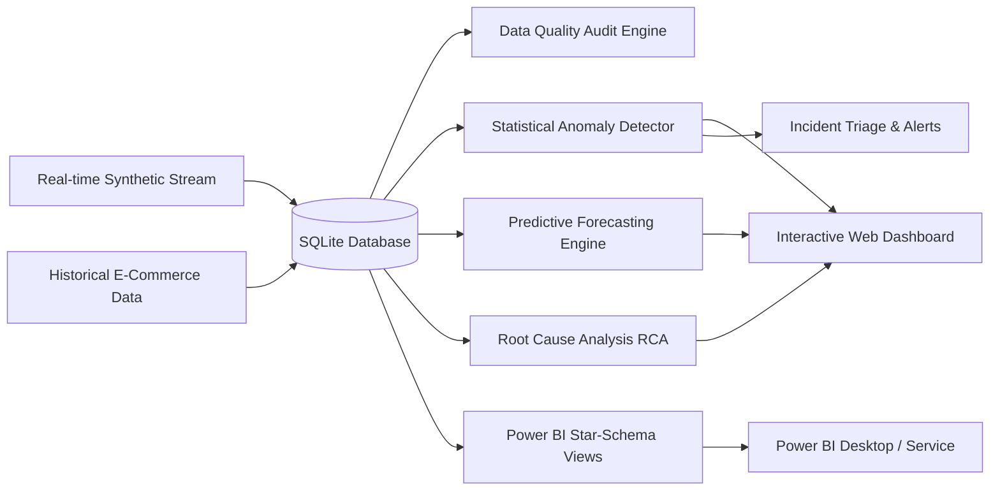

# Automated KPI Monitoring & Alert System
### Real-Time Synthetic Stream • Python & SQL Analytics • Power BI Reporting • Anomaly Detection

[](https://www.python.org/)
[](https://flask.palletsprojects.com/)
[](https://www.sqlite.org/)
[](https://powerbi.microsoft.com/)
[](https://www.chartjs.org/)
[](LICENSE)

> **Resume Summary**: Collected and analyzed operational data using Python and SQL to identify trends and statistical anomalies, ran data quality checks to ensure data integrity, and built Power BI reports and visualizations to communicate findings for faster business decisions.

---

## 🌟 Key Features



### 1. ⚡ Real-Time Synthetic Operational Stream
- **Continuous Stream Simulator**: Background worker generating live e-commerce orders, payments, reviews, and carrier transit times every 4 seconds.
- **Scenario Injector**: Trigger targeted business anomalies on demand:
  - **Revenue Collapse Outage** (-80% drop)
  - **Customer Churn Spike** (30-day cohort attrition)
  - **Logistics Delivery Bottleneck** (18+ day delays)
  - **Payment Gateway Outage** (rejection spikes)
  - **Data Quality Defect Injection** (controlled dirty records)

### 2. 🛡️ Automated Data Quality (DQ) Audit Engine
- Evaluates **8 automated SQL & Python validation rules**:
  1. *Primary Field Completeness* (Null check across primary keys)
  2. *Payment Records Completeness* (Monetary amounts and payment rails)
  3. *Order ID Uniqueness* (Primary key duplicate protection)
  4. *Payment Sequence Uniqueness* (Composite uniqueness)
  5. *Domain Value Validity* (Strictly non-negative payment values)
  6. *Chronological Delivery Logic* (Delivery date $\ge$ purchase date)
  7. *Referential Integrity* (Zero orphan payments or line items)
  8. *CSAT Review Bounds* (Standardized 1–5 scale compliance)
- **Live Integrity Score** with 1-click automated defect remediation.

### 3. 📈 Statistical Trend & 2-Sigma Anomaly Detection
- **Z-Score Detection**: Identifies deviations $> 2.0\sigma$ or $> 2.5\sigma$ from rolling 30-day baselines.
- **Interquartile Range (IQR) Outliers**: Robust outlier scoring resistant to extreme distribution skews.
- **Statistical Process Control (SPC)**: Computes Mean, Std Dev ($\sigma$), Upper Control Limit ($+2\sigma$), and Lower Control Limit ($-2\sigma$).

### 4. 🔮 Predictive Forecasting & What-If Simulator
- **Holt's Linear Double Exponential Smoothing**: Generates 7-day forward-looking time-series forecasts with 95% confidence bands.
- **Early Warning Velocity Drift**: Proactively alerts when metrics are on track to breach thresholds before they occur.
- **Interactive What-If Sensitivity Simulator**: Sliders to simulate price changes, churn shifts, and transit delays with real-time financial impact calculations.

### 5. 🔍 Automated Root-Cause Analysis (RCA)
- Decomposes metric variance across four operational dimensions:
  - **Regional Geography** (State-by-state 7d vs 14d revenue variance)
  - **Product Category Contributions**
  - **Payment Gateway Cancellation Rates**
  - **Logistics & Transit SLA Breaches**
- Generates prescriptive executive recommendations.

### 6. 📊 Power BI Modeling & DAX Suite
- **Optimized SQL Views**: `vw_powerbi_operational_orders`, `vw_powerbi_daily_kpis`.
- **Pre-Built DAX Measures**: Ready in [`powerbi/DAX_MEASURES.dax`](powerbi/DAX_MEASURES.dax) (Revenue, AOV, YoY/DoD Growth %, On-Time Delivery %, SLA Breach Count, CSAT Index, 2-Sigma Control Limits).
- **Automated CSV Exports**: Refreshed into [`data/powerbi/`](data/powerbi/) for instant Power BI desktop ingestion.
- Complete documentation in [`POWER_BI_DEPLOYMENT.md`](POWER_BI_DEPLOYMENT.md).

---

## 📂 Project Structure

```text
kpi-indicator/
├── dashboard.py                  # Flask web server & API orchestration
├── requirements.txt             # Python dependencies
├── POWER_BI_DEPLOYMENT.md       # Step-by-step Power BI guide & star-schema design
├── config/
│   └── kpi_config.json          # KPI SQL queries, thresholds & alert settings
├── data/
│   ├── olist.db                 # SQLite operational database
│   └── powerbi/                 # Automated Power BI CSV dataset exports
│       ├── powerbi_operational_orders.csv
│       ├── powerbi_daily_kpis.csv
│       └── powerbi_data_quality_audit.csv
├── powerbi/
│   └── DAX_MEASURES.dax         # Production-ready Power BI DAX formulas
├── src/
│   ├── anomaly_detector.py      # Statistical Z-Score, IQR, and 2-Sigma SPC engine
│   ├── data_quality.py          # Automated 8-rule SQL & Python integrity auditor
│   ├── synthetic_generator.py   # Real-time background stream & anomaly injector
│   ├── predictive_engine.py     # Holt-linear 7-day forecasting & What-If simulator
│   ├── root_cause_analyzer.py   # Multi-dimensional RCA drill-down diagnostic
│   ├── incident_manager.py      # Incident lifecycle triage & webhook dispatcher
│   ├── powerbi_exporter.py      # Automated dataset export pipeline
│   ├── database.py              # Thread-safe database connection manager
│   ├── kpi_calculator.py        # Core KPI calculation engine
│   └── alert_sender.py          # Email & Slack notification sender
└── templates/
    └── dashboard.html           # Dark-mode responsive analytics dashboard
```

---

## 🚀 Quick Start Guide

### 1. Clone & Install Dependencies
```bash
git clone https://github.com/suvetha-developer/KPI-INDICATOR.git
cd KPI-INDICATOR
pip install -r requirements.txt
```

### 2. Launch Real-Time Dashboard
```bash
python dashboard.py
```
Open **[http://localhost:5000](http://localhost:5000)** in your browser.

---

## 🛠️ Technology Stack
- **Languages**: Python, SQL, DAX
- **Backend & APIs**: Flask, SQLite3, Requests
- **Analytics & Math**: Pandas, NumPy, SciPy (Z-score, IQR, Holt-Winters smoothing)
- **Frontend UI**: Vanilla JavaScript, Chart.js, HTML5/CSS3 (Custom Dark-mode Glassmorphism)
- **BI & Reporting**: Microsoft Power BI Desktop & Service

---

## 📄 License
This project is open-source under the [MIT License](LICENSE).
